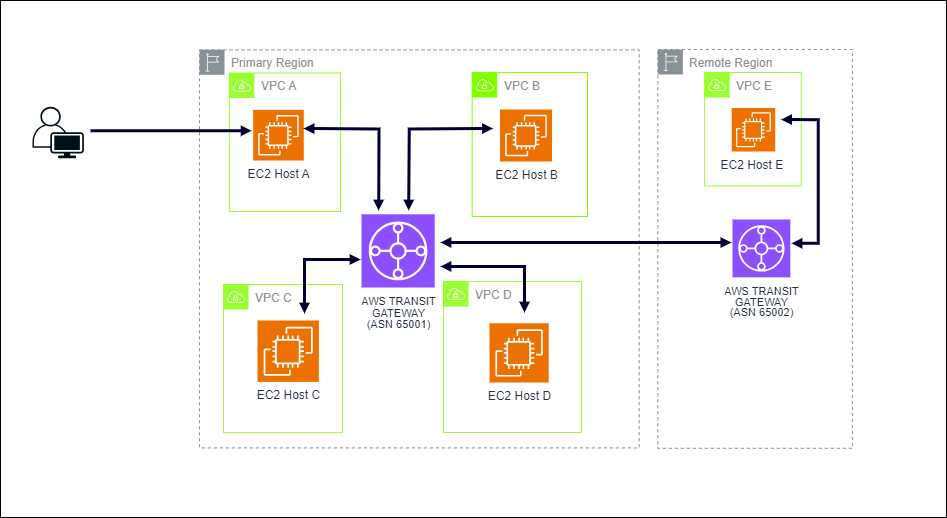

# Inter-Region Peering Project on AWS

## Overview
This project focuses on establishing inter-region peering using AWS Transit Gateway, facilitating seamless communication between resources deployed across multiple AWS regions. By creating peering connections between transit gateways in different regions and configuring routing tables, the project aims to enhance network connectivity and manage traffic efficiently.

## Steps Taken
1. **AWS Transit Gateway Configuration:**
   - Utilized AWS Transit Gateway to manage a unified connection across the network, facilitating complex routing configurations.
   - Peered two transit gateways across regional boundaries to demonstrate inter-regional connectivity.

2. **EC2 Instances and VPCs Setup:**
   - Deployed four Amazon EC2 instances (Hosts A through D) within the primary region, each residing in its own VPC.
   - Host A, situated in a public subnet, serves as the command host.

3. **Transit Gateway Deployment:**
   - Created a transit gateway in the primary region and attached it to the respective VPCs.
   - Leveraged the transit gateway as a network transit hub for interconnecting attachments (VPCs and VPNs) within and across AWS accounts.

4. **Inter-Region Peering:**
   - Established peering between the transit gateway in the primary region and its counterpart in the remote region.
   - Utilized Autonomous System Number (ASN) and Border Gateway Protocol (BGP) for transit gateway peering.

5. **Blackhole Route Implementation:**
   - Implemented blackhole routes for subnets in VPCs B and D to filter network traffic effectively.
   - Blackhole routes in transit gateway route tables aid in dropping traffic matching the specified routes.

## Repository Information
Find the reference diagram used for the project in the repository. The diagram provides visual insights into the architecture and components of the inter-region peering setup.

